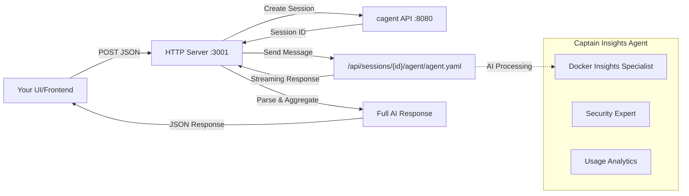

# Docker Insights HTTP Server

A HTTP server that provides an endpoint for UI applications to communicate with the Docker Insights AI agent (Captain Insights) running via `cagent`.

## Overview

This project consists of:
- **HTTP Server**: Express.js server running on `localhost:3001`
- **AI Agent Integration**: Communicates with `cagent` API server on `localhost:8080`
- **Session Management**: Creates sessions and handles streaming responses
- **Single Endpoint**: `/api/captain-insights` accepts POST requests with JSON data
- **Captain Insights Agent**: Specialized AI for Docker Desktop insights and security analysis

## Prerequisites

- Node.js and yarn
- `cagent` binary (included in project)
- `agent.yaml` configuration file (included in project)

## Setup & Installation

### 1. Install Dependencies

```bash
yarn install
```

### 2. Start the AI Agent API Server

First, start the `cagent` API server:

```bash
./cagent api agent.yaml
```

This will start the agent API server on `[::]:8080` and you should see:
```
   ____    __
  / __/___/ /  ___
 / _// __/ _ \/ _ \
/___/\__/_//_/\___/ v4.13.4
High performance, minimalist Go web framework
https://echo.labstack.com
____________________________________O/_______
                                    O\
⇨ http server started on [::]:8080
```

### 3. Start the HTTP Server

In a separate terminal, start the HTTP server:

```bash
yarn http-server
```

This will start the HTTP server on `localhost:3001` with output:
```
Docker Insights HTTP server running on http://localhost:3001

IMPORTANT: Make sure to start the cagent API server first:
  ./cagent api agent.yaml
  (This should start the agent API on localhost:8080)

Available endpoints:
  GET /health - Health check
  POST /api/captain-insights - Receives POST data and communicates with AI agent
```

## Current Status

✅ **FULLY FUNCTIONAL** - The system is working end-to-end!

**What's Working:**
- ✅ HTTP server accepts POST requests to `/api/captain-insights`
- ✅ Automatic session creation with cagent API
- ✅ Real-time communication with Captain Insights AI agent
- ✅ Streaming response parsing and aggregation
- ✅ Full AI analysis responses about Docker Desktop insights
- ✅ Error handling and proper status reporting

**Implementation Details:**
- Uses `/api/sessions` to create new sessions automatically
- Sends messages in OpenAI-style format: `[{"role": "user", "content": "..."}]`
- Handles Server-Sent Events (SSE) streaming responses
- Aggregates streaming chunks into complete AI responses
- Agent name: `agent.yaml` (Captain Insights specialist)

## API Usage

### Health Check

```bash
curl http://localhost:3001/health
```

**Response:**
```json
{
  "status": "healthy",
  "timestamp": "2025-07-17T13:30:00.000Z",
  "service": "docker-insights-api-server"
}
```

### Captain Insights Endpoint

Send data to the AI agent for analysis:

```bash
curl -X POST \
  -H "Content-Type: application/json" \
  -d '{"metric":"users","timespan":"1h","data":"test insights"}' \
  http://localhost:3001/api/captain-insights
```

**Response:**
```json
{
  "received": {
    "metric": "users",
    "timespan": "1h",
    "data": "test insights"
  },
  "agentAnalysis": "Based on your Docker Desktop usage data, I notice you're requesting user metrics for a 1-hour timespan. However, Docker Desktop Insights data is updated daily, not hourly. Let me provide you with insights about user metrics that are available:\n\n**Active Users**: These are users who have actively used Docker Desktop and are signed in with a licensed Docker account...",
  "timestamp": "2025-07-17T13:50:00.000Z",
  "success": true,
  "message": "Request processed by AI agent"
}
```

### Error Response

If the AI agent is not available:

```json
{
  "received": { /* your data */ },
  "agentAnalysis": "Error communicating with agent: Cannot connect to cagent API server. Make sure it's running on localhost:8080",
  "timestamp": "2025-07-17T13:30:00.000Z",
  "success": false,
  "message": "AI agent communication failed"
}
```

## Frontend Integration

### JavaScript/TypeScript Example

```javascript
// Send data to Captain Insights
async function sendToAI(data) {
  try {
    const response = await fetch('http://localhost:3001/api/captain-insights', {
      method: 'POST',
      headers: {
        'Content-Type': 'application/json'
      },
      body: JSON.stringify(data)
    });

    const result = await response.json();

    if (result.success) {
      console.log('AI Analysis:', result.agentAnalysis);
    } else {
      console.error('AI Error:', result.message);
    }

    return result;
  } catch (error) {
    console.error('Network error:', error);
  }
}

// Usage examples - Captain Insights will analyze any data you send
sendToAI({
  metric: 'users',
  timespan: '3m',
  data: 'Please analyze our team Docker usage'
});

sendToAI({
  message: 'What security recommendations do you have?',
  context: { containers: 15, images: 8, vulnerabilities: ['CVE-2023-1234'] }
});

sendToAI({
  question: 'How can we optimize our Docker Desktop deployment?',
  environment: 'development',
  teamSize: 20
});
```

### React Example

```jsx
import { useState } from 'react';

function InsightsComponent() {
  const [analysis, setAnalysis] = useState('');
  const [loading, setLoading] = useState(false);

  const analyzeData = async (data) => {
    setLoading(true);
    try {
      const response = await fetch('http://localhost:3001/api/captain-insights', {
        method: 'POST',
        headers: { 'Content-Type': 'application/json' },
        body: JSON.stringify(data)
      });

      const result = await response.json();
      setAnalysis(result.agentAnalysis);
    } catch (error) {
      setAnalysis('Error connecting to AI agent');
    } finally {
      setLoading(false);
    }
  };

  return (
    <div>
      <button onClick={() => analyzeData({ metric: 'users' })}>
        Get AI Insights
      </button>
      {loading && <p>Analyzing...</p>}
      {analysis && <p>Analysis: {analysis}</p>}
    </div>
  );
}
```

## Development Scripts

```bash
# Development mode (auto-reload)
yarn http-server

# Build TypeScript
yarn build

# Run built version
yarn http-server:build

# Run original MCP server
yarn dev
```

## Troubleshooting

### 1. "Cannot connect to cagent API server"

**Problem**: The HTTP server can't connect to the AI agent.

**Solution**:
- Make sure `cagent` API server is running: `./cagent api agent.yaml`
- Check that port 8080 is available: `lsof -i :8080`
- Verify the agent started successfully (should show Echo server message)

### 2. Port 3001 already in use

**Problem**: Another service is using port 3001.

**Solution**:
- Stop other services on port 3001: `lsof -ti:3001 | xargs kill`
- Or change the port: `HTTP_PORT=3002 yarn http-server`

### 3. AI agent not responding or giving errors

**Problem**: The AI agent returns errors or doesn't respond properly.

**Solution**:
- Ensure the correct agent name is being used (`agent.yaml`)
- Check that sessions are being created properly
- Verify the message format: `[{"role": "user", "content": "..."}]`
- Look for session creation logs in the HTTP server console

### 4. CORS issues from browser

**Problem**: Browser blocks requests due to CORS policy.

**Solution**: The server includes CORS middleware for common development ports:
- `http://localhost:3000` (Create React App)
- `http://localhost:5173` (Vite)
- `http://localhost:8080` (Webpack dev server)

If using a different port, update the CORS configuration in `server/src/http-server.ts`.

### 5. TypeScript compilation errors

**Problem**: `ts-node` fails to compile TypeScript.

**Solution**:
- Check TypeScript configuration: `yarn build`
- Clear node modules: `rm -rf node_modules && yarn install`
- Use built version: `yarn build && yarn http-server:build`

## Project Structure

```
insights-agent/
├── agent.yaml              # AI agent configuration
├── cagent                   # AI agent binary
├── package.json            # Node.js dependencies
├── server/
│   └── src/
│       ├── http-server.ts  # HTTP server (new)
│       └── index.ts        # Original MCP server
├── tsconfig.json           # TypeScript configuration
└── README.md              # This file
```

## Environment Variables

| Variable | Default | Description |
|----------|---------|-------------|
| `HTTP_PORT` | `3001` | Port for HTTP server |
| `BEARER_TOKEN` | - | Docker API token (optional) |
| `DOCKER_INSIGHTS_API_HOST` | `https://api.docker.com` | Docker API host (optional) |

## Architecture



## License

ISC